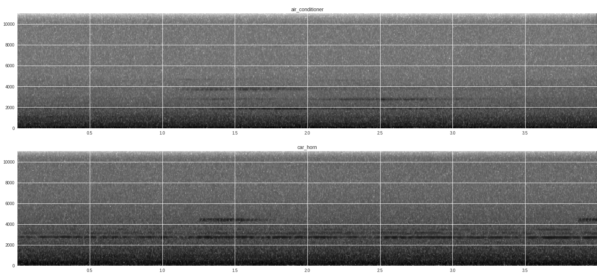
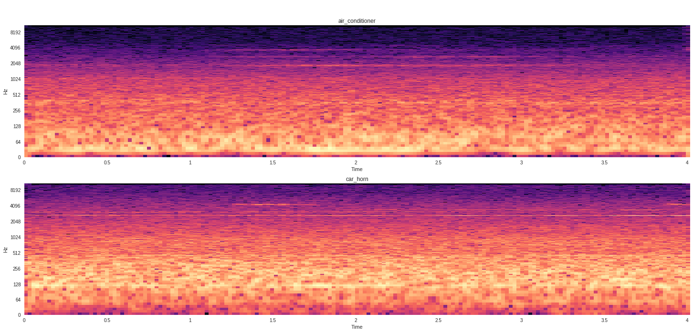

# Classify-Sound-Tensorflow
Classify sound using Deep Learning on Tensorflow

Use spectrogram and log amplitude spectrum for sound featuring.

### You can download the dataset [here](https://serv.cusp.nyu.edu/projects/urbansounddataset/urbansound8k.html)

spectrogram



log amplitude spectrum



I used Feed-Forward multi-perceptron Neural Network, Convolutional Neural Network and Recurrent Neural Network to classify 10 different group of sound.
```text
0 = air_conditioner
1 = car_horn
2 = children_playing
3 = dog_bark
4 = drilling
5 = engine_idling
6 = gun_shot
7 = jackhammer
8 = siren
9 = street_music
```
