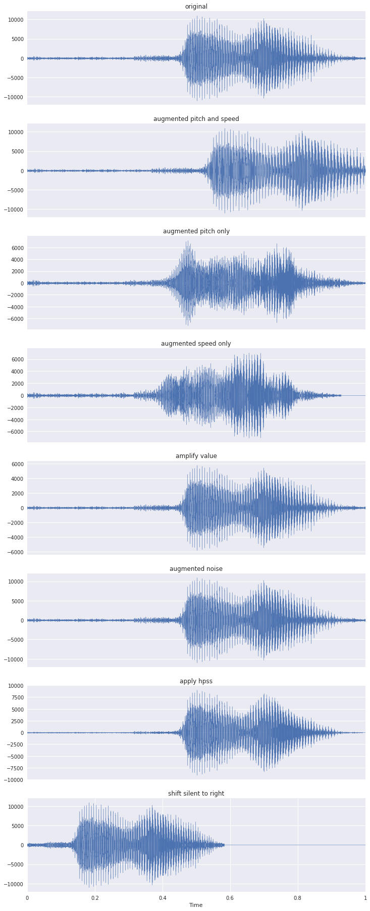

# Sound-Classification-Comparison
Classify sound using Deep Learning on Tensorflow and various machine learning models.

## Features

1. log = Log scale spectrogram
2. spectrogram = spectrogram
3. features = concat(power spectrum, log-energy, mfcc). Check featuring/features.py

## Datasets

1. [Urban sound](https://serv.cusp.nyu.edu/projects/urbansounddataset/urbansound8k.html)
2. [Google dataset](https://research.googleblog.com/2017/08/launching-speech-commands-dataset.html)

## Models

#### Light Gradient Boosting
 1. log
 2. spectrogram

#### eXtreme Gradient Boosting
 1. log

#### Bayes
 1. spectrogram

#### Deep-learning
 1. features on feed-forward
 2. log on convolutional neural network
 3. log on feed-forward
 4. spectrogram on convolutional neural network
 5. spectrogram on feed-forward
 6. spectrogram on recurrent neural network

## Results

#### Spectrogram Urban Sound

* feed-forward neural network
```text
testing accuracy: 0.463215
                  precision    recall  f1-score   support

 air_conditioner       0.41      0.32      0.36       105
        car_horn       0.46      0.40      0.43        58
children_playing       0.33      0.12      0.17       126
        dog_bark       0.67      0.58      0.62       134
        drilling       0.42      0.72      0.53       137
   engine_idling       0.54      0.30      0.39       127
        gun_shot       0.60      0.59      0.60        59
      jackhammer       0.36      0.73      0.49       122
           siren       0.57      0.74      0.64       114
    street_music       0.31      0.13      0.19       119

     avg / total       0.46      0.46      0.44      1101
```

* convolutional neural network
```text
testing accuracy: 0.4
                  precision    recall  f1-score   support

 air_conditioner       0.40      0.20      0.27        10
        car_horn       0.29      0.33      0.31         6
children_playing       0.16      0.33      0.21         9
        dog_bark       0.36      0.31      0.33        16
        drilling       0.50      0.55      0.52        11
   engine_idling       0.56      0.56      0.56         9
        gun_shot       0.33      0.33      0.33         3
      jackhammer       0.57      0.44      0.50         9
           siren       0.46      0.67      0.55         9
    street_music       0.67      0.31      0.42        13

     avg / total       0.45      0.40      0.40        95
```

* recurrent neural network
```text
testing accuracy: 0.453488
                  precision    recall  f1-score   support

 air_conditioner       0.35      0.55      0.43        11
        car_horn       0.50      0.40      0.44         5
children_playing       0.20      0.11      0.14         9
        dog_bark       1.00      0.64      0.78        11
        drilling       0.38      0.45      0.42        11
   engine_idling       1.00      0.44      0.62         9
        gun_shot       1.00      0.50      0.67         2
      jackhammer       0.50      0.60      0.55        10
           siren       0.50      0.22      0.31         9
    street_music       0.26      0.56      0.36         9

     avg / total       0.54      0.45      0.46        86
```

#### Spectrogram Google Dataset
* lgb
```text
accuracy validation set:  0.649594438007
             precision    recall  f1-score   support

        bed       0.56      0.52      0.54       332
       bird       0.84      0.66      0.74       381
        cat       0.64      0.68      0.66       353
        dog       0.61      0.51      0.55       332
       down       0.61      0.55      0.58       476
      eight       0.68      0.73      0.70       470
       five       0.64      0.57      0.60       466
       four       0.67      0.77      0.71       469
         go       0.52      0.54      0.53       478
      happy       0.87      0.84      0.85       368
      house       0.78      0.64      0.70       347
       left       0.59      0.60      0.59       484
     marvin       0.77      0.78      0.78       361
       nine       0.63      0.66      0.64       480
         no       0.61      0.57      0.59       456
        off       0.59      0.67      0.63       456
         on       0.67      0.59      0.63       482
        one       0.65      0.71      0.68       481
      right       0.69      0.62      0.65       446
      seven       0.76      0.72      0.74       485
     sheila       0.89      0.72      0.80       329
        six       0.62      0.81      0.71       490
       stop       0.63      0.56      0.59       466
      three       0.56      0.56      0.56       446
       tree       0.71      0.42      0.53       362
        two       0.48      0.70      0.57       478
         up       0.57      0.74      0.64       474
        wow       0.65      0.59      0.62       343
        yes       0.67      0.64      0.65       461
       zero       0.75      0.75      0.75       493

avg / total       0.66      0.65      0.65     12945
```
* bayes
```text
accuracy validation set:  0.245886442642
             precision    recall  f1-score   support

        bed       0.23      0.31      0.27       359
       bird       0.51      0.35      0.42       361
        cat       0.23      0.26      0.25       351
        dog       0.12      0.13      0.13       348
       down       0.36      0.04      0.07       469
      eight       0.46      0.34      0.39       464
       five       0.12      0.13      0.13       485
       four       0.29      0.52      0.38       444
         go       0.17      0.11      0.13       474
      happy       0.24      0.22      0.23       339
      house       0.26      0.40      0.31       332
       left       0.11      0.28      0.16       474
     marvin       0.19      0.19      0.19       344
       nine       0.32      0.22      0.26       450
         no       0.20      0.09      0.13       484
        off       0.26      0.42      0.32       468
         on       0.38      0.10      0.16       473
        one       0.18      0.15      0.16       481
      right       0.37      0.05      0.09       472
      seven       0.52      0.19      0.28       457
     sheila       0.34      0.39      0.36       354
        six       0.37      0.47      0.42       476
       stop       0.30      0.27      0.28       507
      three       0.27      0.30      0.28       481
       tree       0.31      0.38      0.34       347
        two       0.28      0.31      0.30       543
         up       0.32      0.07      0.12       490
        wow       0.11      0.20      0.14       314
        yes       0.16      0.26      0.20       413
       zero       0.23      0.30      0.26       491

avg / total       0.28      0.25      0.24     12945
```

#### Log-spectrogram Google Dataset
* LGB
```text
accuracy validation set:  0.722689742775
             precision    recall  f1-score   support

        bed       0.64      0.68      0.66       359
       bird       0.82      0.74      0.78       327
        cat       0.77      0.72      0.74       353
        dog       0.78      0.59      0.67       340
       down       0.67      0.67      0.67       457
      eight       0.75      0.79      0.77       466
       five       0.73      0.65      0.69       514
       four       0.78      0.82      0.80       477
         go       0.54      0.61      0.57       463
      house       0.87      0.75      0.80       324
       left       0.75      0.70      0.72       488
     marvin       0.79      0.76      0.78       370
       nine       0.70      0.75      0.72       447
         no       0.70      0.57      0.63       518
        off       0.71      0.74      0.72       450
         on       0.66      0.66      0.66       466
        one       0.72      0.75      0.73       485
      right       0.80      0.73      0.76       453
      seven       0.78      0.73      0.75       467
     sheila       0.88      0.81      0.85       362
        six       0.69      0.85      0.76       469
       stop       0.77      0.73      0.75       452
      three       0.68      0.71      0.70       461
       tree       0.80      0.62      0.70       341
        two       0.65      0.81      0.72       530
         up       0.59      0.80      0.68       470
        wow       0.80      0.71      0.76       358
        yes       0.75      0.70      0.72       470
       zero       0.76      0.78      0.77       459

avg / total       0.73      0.72      0.72     12596
```

* XGB
```text
accuracy validation set:  0.801047951731
             precision    recall  f1-score   support

        bed       0.71      0.78      0.74       330
       bird       0.85      0.83      0.84       348
        cat       0.81      0.85      0.83       362
        dog       0.76      0.70      0.73       351
       down       0.77      0.74      0.75       442
      eight       0.83      0.86      0.85       485
       five       0.80      0.77      0.78       478
       four       0.83      0.88      0.86       460
         go       0.68      0.69      0.69       460
      house       0.90      0.82      0.86       368
       left       0.81      0.78      0.79       495
     marvin       0.87      0.80      0.84       363
       nine       0.81      0.80      0.80       455
         no       0.76      0.74      0.75       468
        off       0.77      0.78      0.78       464
         on       0.78      0.74      0.76       447
        one       0.76      0.82      0.79       418
      right       0.86      0.80      0.83       491
      seven       0.86      0.82      0.84       495
     sheila       0.94      0.87      0.90       359
        six       0.78      0.88      0.83       474
       stop       0.84      0.80      0.82       489
      three       0.78      0.80      0.79       476
       tree       0.81      0.71      0.76       329
        two       0.77      0.81      0.79       506
         up       0.70      0.82      0.76       504
        wow       0.80      0.82      0.81       330
        yes       0.84      0.86      0.85       496
       zero       0.82      0.84      0.83       453

avg / total       0.80      0.80      0.80     12596
```

## images


